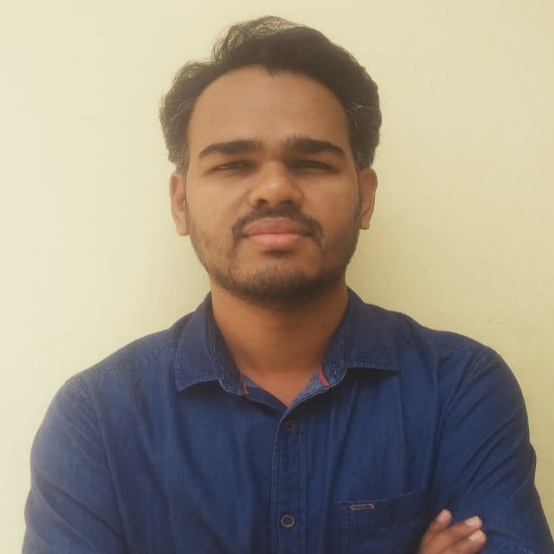

*Hello there, welcome to this BlogSite...!!!*

#### *Who am I?*

<figure class="aligncenter circle image--lg">
	
</figure>

I’m an *Agile, Result-oriented* Engineer from Nagpur, currently living in the Pune, India. I have completed my graduation in __Electronics and Telecommunications *(B.E.)*__ from *YCCE, RTMNU Nagpur University*. After graduation, I completed a __Post Graduate Diploma program in *Embedded Systems*__ from *CDAC, Hyderabad*, before joining the IT industry with *__Persistent Systems__*.\
In my career, spanning over a decade now with Persistent Systems I am steadily progressing from being a Software Engineer in 2011, to __*<u>Senior Engineering Lead</u>*__ *in 2021*, gathering experiences in technology domains like __Telecom-Multimedia__, *Enterprise Content Management*, __*<u>Internet of Things</u>*__, __Cloud__.

#### *Why do I do, Whatever I do?*

Somewhere in 2017-18, I experienced what I would refer as a my own taste of *<u>Mid-Life Crisis</u>*, more of an *Identity Crisis*. I was doing fine in day to day professional tasks, but had very little sense of where my career was heading. I was dissatisfied, unhappy by just being a developer. I could easily conclude, I cannot just be a developer, hoping around some programming languages, switching projects/jobs. I was in search of some Domain/Technology can be __*my identity*__, __*my expertise*__, which I will enjoy to put my heart in it, which will be relevant to my previous experiences/studies and will be relevant to my future aspirations.

__*Eureka...*__
&nbsp;&nbsp; Some introspection led me to __*<u>Internet of Things</u>*__, as my career interest and now here I am, for last <u>3 years, exclusively working on IoT projects</u>, focusing on the <u>Architecture-Design-Implementation</u> of __*IoT/Edge*__ Devices/__*Cloud*__ applications for <u>devices, data & software updates management</u>. In these years, me with my team, successfully delivered 3 projects, based on __*AWS IoT*__, __*Azure IoT*__, __*Ayla IoT*__ Networks, __*Mender.io*__, cloud platforms on __*Nvidia Jetson*__ + __*x86 CCB*__ + __*STM32*__ devices.
In these projects, I have been working on and getting a taste of every aspect of IoT, right from <u>north-side of</u> __*Bootloader on MCUs*__ <u>to the south-side of</u> __*Cloud Applications*__, from being a __*device-to-cloud communication*__ application developer to being a __*Systems Engineer*__ working on <u>Board bring-ups, OS/Firmware flash & Updates</u>.\
&nbsp;&nbsp;&nbsp;&nbsp;&nbsp;&nbsp;&nbsp;&nbsp;&nbsp;&nbsp;&nbsp;&nbsp;&nbsp;&nbsp;&nbsp;&nbsp;&nbsp;&nbsp;&nbsp;&nbsp;&nbsp;&nbsp;&nbsp;&nbsp;&nbsp;&nbsp;&nbsp;&nbsp;&nbsp;&nbsp;&nbsp;&nbsp;&nbsp;&nbsp;&nbsp;&nbsp;&nbsp;&nbsp;&nbsp;&nbsp;&nbsp;&nbsp;&nbsp;&nbsp;&nbsp;&nbsp;&nbsp;&nbsp;&nbsp;&nbsp;&nbsp;&nbsp;&nbsp;&nbsp;&nbsp;&nbsp;&nbsp;&nbsp;&nbsp;&nbsp;&nbsp;&nbsp;&nbsp;&nbsp;&nbsp;&nbsp;&nbsp;&nbsp;&nbsp;&nbsp;&nbsp;&nbsp;&nbsp;&nbsp;&nbsp;&nbsp;&nbsp;&nbsp;&nbsp;&nbsp;&nbsp;&nbsp;&nbsp;&nbsp;&nbsp;&nbsp;&nbsp;&nbsp;&nbsp;&nbsp;&nbsp;&nbsp;&nbsp;&nbsp;&nbsp;&nbsp;&nbsp;&nbsp;&nbsp;&nbsp;&nbsp;&nbsp;&nbsp;&nbsp;&nbsp;&nbsp;&nbsp;&nbsp;&nbsp;&nbsp;&nbsp;&nbsp;&nbsp;&nbsp;&nbsp;&nbsp;&nbsp;&nbsp;&nbsp;&nbsp;&nbsp;&nbsp;&nbsp;&nbsp;&nbsp;&nbsp;&nbsp;&nbsp;&nbsp;&nbsp;&nbsp;&nbsp;&nbsp;&nbsp;&nbsp;&nbsp;&nbsp;&nbsp;&nbsp;&nbsp;&nbsp;&nbsp;&nbsp;&nbsp;&nbsp;&nbsp;&nbsp;&nbsp;&nbsp; [<u>detailed CV here...</u>](cv.html)

#### *What's this BlogSite?*

Ok, Again, something about myself...\
I have an habit, you can say a *Good habit* of <u>making notes, writing down</u> whatever I am studying. Few years before, I was reborn as a Digital human-being and started making notes in text/word editors.
Also another Good habit of me is <u>Pinning down references</u>, to recall where did I leaned or read that.
Pinning references have been immensely useful during the dilema of was that really suppose to work that way, or when situation arises where we need to back something with evidence.
But over the years, I have got a huge repository of such text/ms-word/bookmarks, which is getting messy to be maintained offline, and the real pain is to search through this, kind of __*my-own digital book-shelf*__.
What to do about it?

Another reason,\
Couple of years back, I came across a new concept [__*<u>Me Enterprise</u>*__](https://www.amazon.in/Emergence-Enterprise-Blueprint-Leadership-Century/dp/1619845091) through a seminar in my office itself. The speaker was also the author of the book with same title.
This concept is about focusing on yourself, about treating yourself some kind of an organization, or an enterprise.
It emphasizes on the fact that In today's world, *<u>we are the owner, creator and nourisher of our own life</u>*, specifically our professional life. We ourself have to sell ourself in the market.
Today, everything is Digital, everything has an online presence, then how can we IT, Software, Technology workers be left behind. We need to have our own presence here, we need to create a brand of ourself, and market it. That's Me Enterprise.
This BlogSite is my beginning and the __*<u>Journey of Me Myself as an Enterprise</u>*__.

While this website is mostly meant as a journal for myself, it is also a portfolio for future collaborators/recruiters. If you want to get in touch for advice/collaborations, job offers or just to say hi, the quicket way is by email or Twitter. The links are at the bottom of the page.

Happy exploring!!!\
__*<u>Akhilesh</u>*__

&nbsp;
#### Disclaimer:
The blogs on this site are mostly as a journal for myself, and it has been put in public domain to help someone interested.
The contents for muliple articles are sourced from various forums, blogs, technical writeups/documentations.
I have been and will always try to add references to the source articles, but there can be instances where I could not recall the original source of material.
The rights of the contents, partial or full will always be with their original owners.

